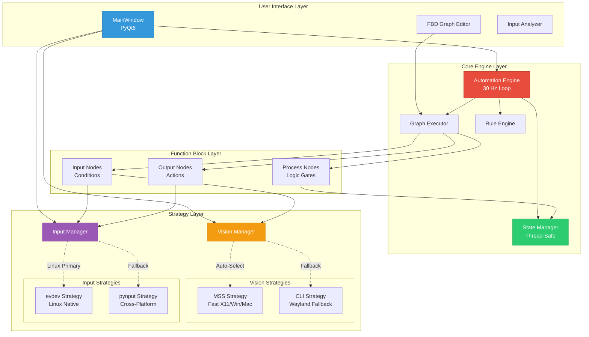
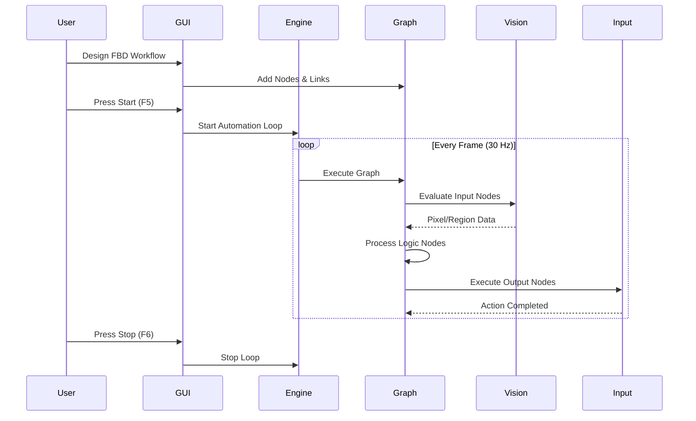
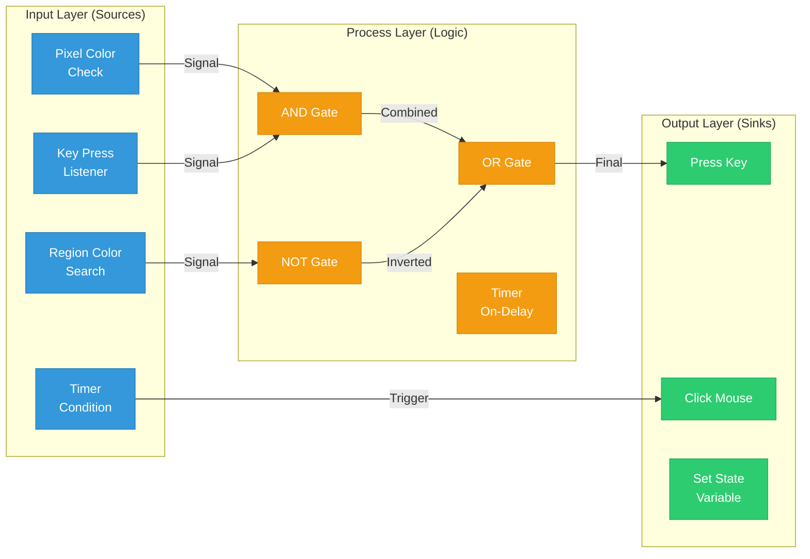

# PixelPilot

<div align="center">

**A Cross-Platform Visual Automation Framework**


PixelPilot is a visual, no-code automation tool inspired by industrial Function Block Diagram (FBD) programming, similar to Siemens STEP 7. It enables users to create complex automation workflows through an intuitive graphical interface without requiring programming knowledge.

</div>

---

## 📋 Table of Contents

- [Overview](#-overview)
- [Key Features](#-key-features)
- [Architecture](#-architecture)
- [Project Structure](#-project-structure)
- [Installation](#-installation)
- [Usage](#-usage)
- [Core Concepts](#-core-concepts)
- [Development](#-development)
- [Best Practices Analysis](#-best-practices-analysis)
- [Roadmap](#-roadmap)
- [Contributing](#-contributing)
- [License](#-license)

---

## 🎯 Overview

PixelPilot bridges the gap between industrial automation programming and desktop automation by providing:

- **Visual Programming**: Function Block Diagram (FBD) interface inspired by PLC programming
- **Cross-Platform Support**: Works on Linux (X11/Wayland), Windows, and macOS
- **No-Code Approach**: Create automation without writing code
- **Modular Architecture**: Extensible design for future enhancements

### Target Users

- **Automation Enthusiasts**: Users wanting to automate repetitive tasks
- **Non-Programmers**: Visual interface requires no coding knowledge
- **Power Users**: Advanced users can extend functionality through the modular design
- **Industrial Engineers**: Familiar FBD paradigm for rapid automation development

---

## ✨ Key Features

### Visual Function Block Editor
- Drag-and-drop interface for creating automation workflows
- Real-time visual feedback with connection validation
- Double-click configuration for blocks

### Input Detection
- **Vision System**: Pixel color matching and region scanning
- **Keyboard Monitoring**: Global key press detection and triggers
- Platform-adaptive strategy pattern (MSS, CLI tools, evdev)

### Process Logic
- **Logic Gates**: AND, OR, NOT, NAND, XOR
- **Timers**: Delay and interval-based triggers
- **State Management**: Shared variable system for complex workflows

### Output Actions
- **Keyboard Control**: Simulate key presses
- **Mouse Control**: Click and movement simulation
- **State Manipulation**: Update shared variables

### Cross-Platform Compatibility
| Platform | Vision Strategy | Input Strategy |
|----------|----------------|----------------|
| Linux X11 | MSS (Primary) | evdev (Primary), pynput (Fallback) |
| Linux Wayland | CLI (spectacle/grim) | evdev (Primary), pynput (Fallback) |
| Windows | MSS | pynput |
| macOS | MSS | pynput |

---

## 🏗️ Architecture

### High-Level System Architecture



### Component Interaction Flow



### Function Block Diagram (FBD) Execution Model



---

## 📁 Project Structure

```
PixelPilot/
├── main.py                      # Application entry point
├── requirements.txt             # Python dependencies
├── LICENSE                      # GPL-3.0 License
├── README.md                    # This file
├── .gitignore                   # Git ignore patterns
│
├── src/                         # Source code directory
│   ├── core/                    # Core automation engine
│   │   ├── engine.py           # Main automation loop (30 Hz)
│   │   ├── graph.py            # FBD graph execution logic
│   │   ├── rules.py            # Condition/Action definitions
│   │   └── state.py            # Thread-safe state management
│   │
│   ├── strategies/              # Platform-adaptive strategies
│   │   ├── vision.py           # Screen capture strategies
│   │   └── input.py            # Input simulation strategies
│   │
│   ├── gui/                     # PyQt6 user interface
│   │   ├── main_window.py      # Main application window
│   │   ├── analyzer.py         # Input event analyzer
│   │   ├── styles.py           # Dark theme styling
│   │   ├── workers.py          # QThread workers
│   │   │
│   │   ├── graph/              # Graph editor components
│   │   │   ├── scene.py        # QGraphicsScene for FBD
│   │   │   ├── graphics.py     # Visual node/link rendering
│   │   │   └── dialogs.py      # Node configuration dialogs
│   │   │
│   │   └── widgets/            # (Reserved for custom widgets)
│   │
│   └── utils/                   # (Reserved for utilities)
│
└── tests/                       # Unit tests
    ├── test_rules.py           # Rule engine tests
    ├── test_vision.py          # Vision strategy tests
    └── test_input.py           # Input strategy tests
```

### Directory Responsibilities

| Directory | Responsibility | Coupling |
|-----------|---------------|----------|
| `src/core/` | Platform-agnostic automation logic | Low |
| `src/strategies/` | Platform-specific implementations | Medium |
| `src/gui/` | User interface and visualization | High (GUI only) |
| `tests/` | Unit and integration tests | Low |

---

## 🚀 Installation

### Prerequisites

- **Python 3.8+**
- **Operating System**: Linux (X11/Wayland), Windows 10+, or macOS 10.14+

### System Dependencies

#### Linux (Debian/Ubuntu)
```bash
# For evdev input strategy (requires uinput permissions)
sudo apt-get install python3-evdev

# For Wayland support (choose one)
sudo apt-get install spectacle  # KDE
sudo apt-get install grim       # wlroots compositors

# Grant uinput access (Linux only)
sudo usermod -a -G input $USER
sudo modprobe uinput
echo 'KERNEL=="uinput", MODE="0660", GROUP="input"' | sudo tee /etc/udev/rules.d/99-uinput.rules
sudo udevadm control --reload-rules && sudo udevadm trigger
```

#### Windows
No additional system dependencies required.

#### macOS
```bash
# Grant accessibility permissions when prompted
```

### Python Dependencies

```bash
# Clone the repository
git clone https://github.com/yourusername/PixelPilot.git
cd PixelPilot

# Create virtual environment (recommended)
python3 -m venv venv
source venv/bin/activate  # Linux/macOS
# venv\Scripts\activate   # Windows

# Install dependencies
pip install -r requirements.txt
```

### Verify Installation

```bash
# Run the application
python main.py
```

---

## 💡 Usage

### Getting Started

1. **Launch PixelPilot**
   ```bash
   python main.py
   ```

2. **Create Your First Automation**
   
   a. **Add Input Block**: Click "Add Input Block" (detects pixel color or key press)
   
   b. **Add Process Block**: Click "Add Process Block" (logic gates like AND/OR)
   
   c. **Add Output Block**: Click "Add Output Block" (performs actions)
   
   d. **Connect Blocks**: Click and drag from output ports to input ports
   
   e. **Configure Blocks**: Double-click any block to configure its parameters

3. **Configure an Input Block (Example: Pixel Color)**
   - Double-click the Input block
   - Select "Pixel Color" trigger type
   - Set X, Y coordinates (e.g., 100, 100)
   - Set target RGB color (e.g., 255, 255, 255 for white)
   - Click "Save"

4. **Configure an Output Block (Example: Key Press)**
   - Double-click the Output block
   - Enter key code (e.g., "space", "enter", "a")
   - Click "Save"

5. **Run the Automation**
   - Press **F5** or click "Start"
   - The engine will monitor the screen at 30 Hz
   - Actions trigger when conditions are met
   - Press **F6** or click "Stop" to halt

### Advanced Features

#### Input Analyzer
- Click "Input Analyzer" to monitor keyboard events in real-time
- Useful for determining exact key codes for triggers

#### Logic Combination
Create complex workflows by chaining logic blocks:
```
[Pixel Check A] ──┐
                  ├──► [AND] ──► [Press Key]
[Key Press B]  ──┘
```

#### State Variables
Use `SetStateAction` and state-aware conditions to create:
- Toggles
- Counters
- Multi-step sequences

---

## 🧩 Core Concepts

### 1. Function Block Diagram (FBD) Paradigm

PixelPilot uses the **IEC 61131-3** inspired FBD model with three block types:

| Block Type | Purpose | Examples |
|------------|---------|----------|
| **Input** | Detect conditions | Pixel color, key press, timer |
| **Process** | Apply logic | AND, OR, NOT, NAND, XOR |
| **Output** | Execute actions | Press key, click mouse, set state |

### 2. Strategy Pattern

Platform-specific implementations are abstracted using the **Strategy Pattern**:

**Vision Strategies:**
- `MSSStrategy`: Fast screen capture using `mss` library
- `CLIStrategy`: Wayland fallback using `spectacle`/`grim`/`scrot`

**Input Strategies:**
- `EvdevStrategy`: Linux native uinput for low-level control
- `PynputStrategy`: Cross-platform fallback using `pynput`

The `VisionManager` and `InputManager` automatically select the best strategy for your platform.

### 3. Execution Model

The automation engine runs at **30 Hz** (configurable):

1. **Evaluate Input Nodes**: Check all conditions (pixel colors, key states)
2. **Process Logic Nodes**: Compute logic gates (multiple passes for depth)
3. **Execute Output Nodes**: Perform actions if triggered
4. **Repeat**: Loop continues until stopped

### 4. Thread Safety

- **StateManager**: Thread-safe dictionary with mutex locks
- **AutomationEngine**: Lock-protected rule list for dynamic updates
- **QThread Workers**: GUI interaction runs in separate thread

---

## 🛠️ Development

### Running Tests

```bash
# Run all tests
python -m unittest discover tests

# Run specific test
python -m unittest tests.test_rules
```

### Code Style

This project follows **PEP 8** conventions:
```bash
# Install development tools
pip install black flake8 mypy

# Format code
black src/ tests/

# Lint
flake8 src/ tests/

# Type checking
mypy src/
```

### Adding New Strategies

#### Example: New Vision Strategy

```python
# src/strategies/vision.py

class NewVisionStrategy(VisionStrategy):
    def __init__(self):
        # Initialize your implementation
        pass
    
    def get_pixel(self, x: int, y: int) -> Optional[Tuple[int, int, int]]:
        # Implement pixel retrieval
        pass
    
    def search_color(self, region, target_rgb, tolerance=10):
        # Implement color search
        pass
```

Then update `VisionManager._init_strategy()` to include detection logic.

### Adding New Block Types

#### Example: Custom Input Condition

```python
# src/core/rules.py

class CustomCondition(Condition):
    def __init__(self, param1, param2):
        self.param1 = param1
        self.param2 = param2
    
    def evaluate(self, state, vision_provider=None, input_provider=None) -> bool:
        # Implement your logic
        return True  # or False
```

#### Example: Custom Output Action

```python
# src/core/rules.py

class CustomAction(Action):
    def __init__(self, param):
        self.param = param
    
    def execute(self, state, input_provider=None):
        # Perform your action
        pass
```

---

## ✅ Best Practices Analysis

### Strengths ✅

#### 1. **Modular Architecture**
- Clear separation of concerns (Core, Strategies, GUI)
- Low coupling between platform-agnostic and platform-specific code
- Easy to extend with new strategies or block types

#### 2. **Strategy Pattern Implementation**
- Excellent use of abstract base classes (`VisionStrategy`, `InputStrategy`)
- Automatic platform detection and fallback mechanisms
- Managers (`VisionManager`, `InputManager`) encapsulate complexity

#### 3. **Thread Safety**
- `StateManager` uses mutex locks for concurrent access
- `AutomationEngine` protects shared rule list
- Proper QThread usage in GUI

#### 4. **Cross-Platform Design**
- Conditional imports handle missing dependencies gracefully
- Platform-specific strategies isolated in `strategies/` module
- Comprehensive platform support (Linux X11/Wayland, Windows, macOS)

#### 5. **Clean Code Structure**
- Consistent naming conventions
- Meaningful abstractions (Condition, Action, Node, Port, Link)
- Self-documenting code with clear class responsibilities

#### 6. **Testability**
- Mock-friendly design (dependency injection)
- Unit tests for core functionality
- Clear interfaces for testing

### Areas for Improvement 🔧

#### 1. **Configuration Management**
**Issue**: Hardcoded values scattered throughout code
```python
# Current: Hardcoded in engine.py
self._target_hz = 30
```

**Recommendation**:
```python
# Use configuration file
# config.yaml
engine:
  target_hz: 30
  max_depth: 3
  
vision:
  default_tolerance: 10
```

**Implementation**:
```python
# src/utils/config.py
import yaml

class Config:
    def __init__(self, config_path='config.yaml'):
        with open(config_path) as f:
            self.data = yaml.safe_load(f)
    
    def get(self, key_path, default=None):
        # Navigate nested keys like 'engine.target_hz'
        pass
```

#### 2. **Error Handling and Logging**
**Issue**: Inconsistent error handling, silent failures in some areas

**Recommendation**:
- Implement custom exception hierarchy
- Add structured logging with levels (DEBUG, INFO, WARNING, ERROR)
- Provide user-friendly error messages in GUI

**Example**:
```python
# src/core/exceptions.py
class PixelPilotError(Exception):
    """Base exception for PixelPilot"""
    pass

class VisionStrategyError(PixelPilotError):
    """Vision system not available"""
    pass

class InputStrategyError(PixelPilotError):
    """Input system not available"""
    pass
```

#### 3. **Documentation**
**Issue**: Limited docstrings, no API documentation

**Recommendation**:
- Add comprehensive docstrings (Google or NumPy style)
- Generate API documentation with Sphinx
- Include usage examples in docstrings

**Example**:
```python
class AutomationEngine:
    """
    Main automation loop executor.
    
    Manages the execution of function block diagrams at a configurable
    rate (default 30 Hz). Coordinates vision input, logic processing,
    and action output.
    
    Args:
        vision_manager (VisionManager): Screen capture provider
        input_manager (InputManager): Input simulation provider
        state_manager (StateManager): Shared state storage
        
    Attributes:
        rules (List[Rule]): Active automation rules
        _running (bool): Engine execution state
        _target_hz (int): Target loop frequency
        
    Example:
        >>> engine = AutomationEngine(vision_mgr, input_mgr, state_mgr)
        >>> engine.add_rule(my_rule)
        >>> engine.start()
    """
```

#### 4. **Type Hints**
**Issue**: Inconsistent type annotations

**Recommendation**:
- Add type hints to all public methods
- Use `typing` module for complex types
- Enable mypy static type checking in CI/CD

**Example**:
```python
from typing import List, Optional, Tuple

def add_rule(self, rule: Rule) -> None:
    """Add a rule to the automation engine."""
    with self._lock:
        self.rules.append(rule)

def get_pixel(self, x: int, y: int) -> Optional[Tuple[int, int, int]]:
    """Get RGB color at pixel coordinates."""
    pass
```

#### 5. **Project Organization**
**Issue**: Empty `utils/` and `widgets/` directories

**Recommendation**:
- Remove empty directories or populate them
- Add `__init__.py` files for proper package structure
- Consider adding:
  - `src/utils/config.py` - Configuration management
  - `src/utils/logger.py` - Logging utilities
  - `src/utils/validators.py` - Input validation
  - `src/gui/widgets/node_palette.py` - Custom palette widget

#### 6. **Dependency Management**
**Issue**: Basic `requirements.txt` without version locking

**Recommendation**:
Use `requirements.txt` for ranges, `requirements-lock.txt` for exact versions:

```txt
# requirements.txt
PyQt6>=6.4.0,<7.0.0
mss>=9.0.1,<10.0.0
pynput>=1.7.6,<2.0.0
evdev>=1.6.1,<2.0.0; sys_platform == 'linux'
Pillow>=10.0.0,<11.0.0
```

Generate lock file:
```bash
pip freeze > requirements-lock.txt
```

Or migrate to **Poetry** or **PDM** for better dependency management:
```toml
# pyproject.toml
[tool.poetry.dependencies]
python = "^3.8"
PyQt6 = "^6.4.0"
mss = "^9.0.1"
pynput = "^1.7.6"
Pillow = "^10.0.0"

[tool.poetry.dependencies.evdev]
version = "^1.6.1"
markers = "sys_platform == 'linux'"
```

#### 7. **Graph Execution**
**Issue**: Naive multi-pass execution in `graph.py`

**Current**:
```python
# graph.py line 158
for _ in range(3):  # Hardcoded depth
    for node in self.nodes:
        if isinstance(node, ProcessNode):
            node.evaluate(...)
```

**Recommendation**: Implement topological sort for optimal single-pass execution

```python
def _topological_sort(self) -> List[Node]:
    """
    Sort nodes by dependencies using Kahn's algorithm.
    Returns nodes in execution order.
    """
    in_degree = {node.id: 0 for node in self.nodes}
    adj_list = {node.id: [] for node in self.nodes}
    
    # Build graph
    for link in self.links:
        source_id = link.source.node.id
        target_id = link.target.node.id
        adj_list[source_id].append(target_id)
        in_degree[target_id] += 1
    
    # Kahn's algorithm
    queue = [node for node in self.nodes if in_degree[node.id] == 0]
    sorted_nodes = []
    
    while queue:
        node = queue.pop(0)
        sorted_nodes.append(node)
        for neighbor_id in adj_list[node.id]:
            in_degree[neighbor_id] -= 1
            if in_degree[neighbor_id] == 0:
                neighbor = next(n for n in self.nodes if n.id == neighbor_id)
                queue.append(neighbor)
    
    if len(sorted_nodes) != len(self.nodes):
        raise ValueError("Graph contains cycles!")
    
    return sorted_nodes

def execute(self, state_mgr, vision_mgr, input_mgr):
    """Execute graph in topological order (single pass)."""
    sorted_nodes = self._topological_sort()
    for node in sorted_nodes:
        node.evaluate(state_mgr, vision_mgr, input_mgr)
```

#### 8. **Testing Coverage**
**Issue**: Limited test coverage (only 3 test files)

**Recommendation**:
- Increase coverage to >80%
- Add integration tests
- Test strategy auto-detection
- Test GUI components with QTest
- Use `pytest` and `pytest-cov`

```bash
# Install test tools
pip install pytest pytest-cov pytest-qt

# Run with coverage
pytest --cov=src --cov-report=html tests/
```

#### 9. **Input Strategy Completion**
**Issue**: Incomplete mouse positioning in `EvdevStrategy`

**Current**:
```python
def move_mouse(self, x: int, y: int):
    # Stub
    pass
```

**Recommendation**: Implement absolute mouse positioning

```python
def __init__(self):
    # ... existing code ...
    
    # Add mouse capabilities
    cap = {
        e.EV_KEY: [e.BTN_LEFT, e.BTN_RIGHT, e.BTN_MIDDLE],
        e.EV_REL: [e.REL_X, e.REL_Y],  # Relative
        e.EV_ABS: [
            (e.ABS_X, (0, 1920, 0, 0)),  # Absolute X
            (e.ABS_Y, (0, 1080, 0, 0))   # Absolute Y
        ]
    }
    self.ui = UInput(cap, name='pixelpilot-virtual-device')

def move_mouse(self, x: int, y: int):
    """Move mouse to absolute position."""
    self.ui.write(e.EV_ABS, e.ABS_X, x)
    self.ui.write(e.EV_ABS, e.ABS_Y, y)
    self.ui.syn()
```

#### 10. **Serialization/Persistence**
**Issue**: No way to save/load FBD graphs

**Recommendation**: Implement JSON serialization

```python
# src/core/serialization.py
import json
from typing import Dict, Any

class GraphSerializer:
    @staticmethod
    def serialize(graph: Graph) -> str:
        """Serialize graph to JSON string."""
        data = {
            'nodes': [
                {
                    'id': node.id,
                    'type': type(node).__name__,
                    'name': node.name,
                    'position': node.position,
                    'config': node.serialize_config()
                }
                for node in graph.nodes
            ],
            'links': [
                {
                    'source_node_id': link.source.node.id,
                    'source_port': link.source.name,
                    'target_node_id': link.target.node.id,
                    'target_port': link.target.name
                }
                for link in graph.links
            ]
        }
        return json.dumps(data, indent=2)
    
    @staticmethod
    def deserialize(json_str: str) -> Graph:
        """Deserialize graph from JSON string."""
        # Implementation here
        pass
```

Usage in GUI:
```python
# Save
def save_graph(self):
    filename, _ = QFileDialog.getSaveFileName(self, "Save Graph", "", "PixelPilot Files (*.pp)")
    if filename:
        json_data = GraphSerializer.serialize(self.scene.graph)
        with open(filename, 'w') as f:
            f.write(json_data)

# Load
def load_graph(self):
    filename, _ = QFileDialog.getOpenFileName(self, "Load Graph", "", "PixelPilot Files (*.pp)")
    if filename:
        with open(filename, 'r') as f:
            json_data = f.read()
        self.scene.graph = GraphSerializer.deserialize(json_data)
        self.scene.rebuild_visuals()
```

### Security Considerations 🔒

#### 1. **Input Validation**
Always validate user input in configuration dialogs:

```python
def save_custom_fields(self):
    # Validate coordinate ranges
    x = max(0, min(self.x_spin.value(), 9999))
    y = max(0, min(self.y_spin.value(), 9999))
    
    # Validate RGB values
    r = max(0, min(self.r_spin.value(), 255))
    g = max(0, min(self.g_spin.value(), 255))
    b = max(0, min(self.b_spin.value(), 255))
```

#### 2. **Permission Management**
Document required permissions clearly:

```markdown
### Linux Permissions Required
- `uinput` access for keyboard/mouse simulation
- Read access to `/dev/input/*` for event listening
- X11/Wayland display access for screen capture
```

#### 3. **Sandboxing**
Consider implementing execution sandboxing for loaded graphs:
- Limit resource usage (CPU, memory)
- Restrict file system access
- Validate loaded JSON schemas

---

## 🗺️ Roadmap

### Phase 1: Foundation (Current) ✅
- [x] Core automation engine
- [x] Strategy pattern for cross-platform support
- [x] Basic GUI with FBD editor
- [x] Input/Process/Output blocks
- [x] Vision and input detection

### Phase 2: Stability (Next)
- [ ] Comprehensive test coverage (>80%)
- [ ] Error handling and logging framework
- [ ] Configuration management system
- [ ] Graph serialization (save/load)
- [ ] Complete documentation with Sphinx

### Phase 3: Enhancement
- [ ] Advanced blocks (templates, functions, loops)
- [ ] Recording/playback mode
- [ ] Visual debugging (highlight active blocks)
- [ ] Performance profiling tools
- [ ] Plugin system for custom blocks

### Phase 4: Ecosystem
- [ ] Block library marketplace
- [ ] Community templates repository
- [ ] Cloud sync for graphs
- [ ] Collaboration features
- [ ] WebAssembly version for browser

---

## 🤝 Contributing

Contributions are welcome! Please follow these guidelines:

### Development Setup

1. Fork the repository
2. Create a feature branch: `git checkout -b feature/amazing-feature`
3. Install development dependencies: `pip install -r requirements-dev.txt`
4. Make your changes
5. Run tests: `pytest tests/`
6. Format code: `black src/ tests/`
7. Commit: `git commit -m 'Add amazing feature'`
8. Push: `git push origin feature/amazing-feature`
9. Open a Pull Request

### Code Guidelines

- Follow PEP 8 style guide
- Add type hints to all public methods
- Write docstrings (Google style)
- Include unit tests for new features
- Update README.md if adding user-facing features

### Commit Message Format

```
<type>(<scope>): <subject>

<body>

<footer>
```

**Types**: feat, fix, docs, style, refactor, test, chore

**Example**:
```
feat(vision): add OpenCV strategy for advanced image matching

Implements template matching and feature detection using OpenCV.
Falls back to MSS if OpenCV is not available.

Closes #42
```

---

## 📄 License

This project is licensed under the **GNU General Public License v3.0** - see the [LICENSE](LICENSE) file for details.

### Key Points:
- ✅ Free to use, modify, and distribute
- ✅ Must disclose source code
- ✅ Must use same license for derivatives
- ✅ Can be used commercially

---

## 🙏 Acknowledgments

- **Siemens STEP 7** - Inspiration for FBD paradigm
- **IEC 61131-3** - Programming language standard
- **PyQt6** - Powerful GUI framework
- **mss** - Fast cross-platform screen capture
- **evdev** - Linux input device interface

---

## 📞 Support

- **Issues**: [GitHub Issues](https://github.com/yourusername/PixelPilot/issues)
- **Discussions**: [GitHub Discussions](https://github.com/yourusername/PixelPilot/discussions)
- **Email**: support@pixelpilot.dev (placeholder)

---

## 📊 Project Status


**Last Updated**: 2026-01-26

---

<div align="center">

Made with ❤️ by the PixelPilot Team

[⬆ Back to Top](#pixelpilot)

</div>
